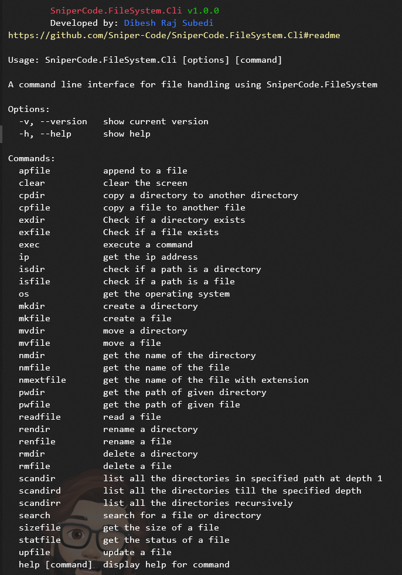

# SniperCode.FileSystem.Cli


## **Table of Contents**

- [SniperCode.FileSystem.Cli](#snipercodefilesystemcli)
  - [**Table of Contents**](#table-of-contents)
  - [**Introduction**](#introduction)
  - [**Installation**](#installation)
  - [**Uninstall**](#uninstall)
  - [**Usage**](#usage)
  - [**References**](#references)
    - [**Articles**](#articles)
    - [**Packages**](#packages)
  - [**ToDo**](#todo)
  - [**Release**](#release)

## **Introduction**

A command line interface for file handling using [SniperCode.FileSystem](https://github.com/Sniper-Code/SniperCode.FileSystem)

## **Installation**

To install the package, run the following command:

```bash
npm install sniperCode.filesystem.cli
```

## **Uninstall**

To uninstall SniperCode.FileSystem, run `npm uninstall sniperCode.filesystem.cli`.

## **Usage**

This package is a command line interface for file handling using [SniperCode.FileSystem](https://github.com/Sniper-Code/SniperCode.FileSystem) package. It provides a command line interface for file handling along with some other useful commands. After the installation, you can run the following command to see the usage of SniperCode.FileSystem.Cli:

```bash
    sfs
```

This command will show the usage of SniperCode.FileSystem.Cli as shown in picture below.



## **References**

All references required while building this package are listed in this document.

### **Articles**

1. [Codeburst.io](https://codeburst.io/build-a-command-line-interface-cli-application-with-node-js-59becec90e28)
2. [Twilio.com](https://www.twilio.com/blog/how-to-build-a-cli-with-node-js)

### **Packages**

1. [SniperCode.FileSystem](https://github.com/Sniper-Code/SniperCode.FileSystem)
2. [Commander](https://www.npmjs.com/package/commander)
3. [Inquirer](https://www.npmjs.com/package/inquirer)
4. [Color](https://www.npmjs.com/package/colors)
5. [Config](https://www.npmjs.com/package/config)

## **ToDo**

1. [ ] Direct execution instead of using [Inquirer](https://www.npmjs.com/package/inquirer) .
2. [ ] Backward compatibility with older terminal.
3. [ ] Custom terminal.

## **Release**

Visit[GitHub Release](https://github.com/Sniper-Code/SniperCode.FileSystem.Cli/releases) to see the latest release.
